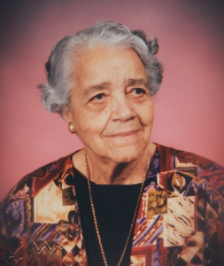
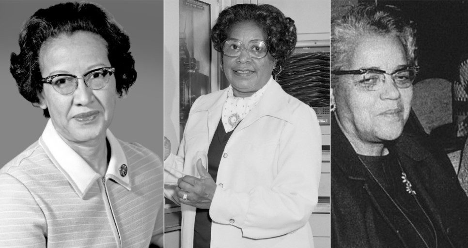
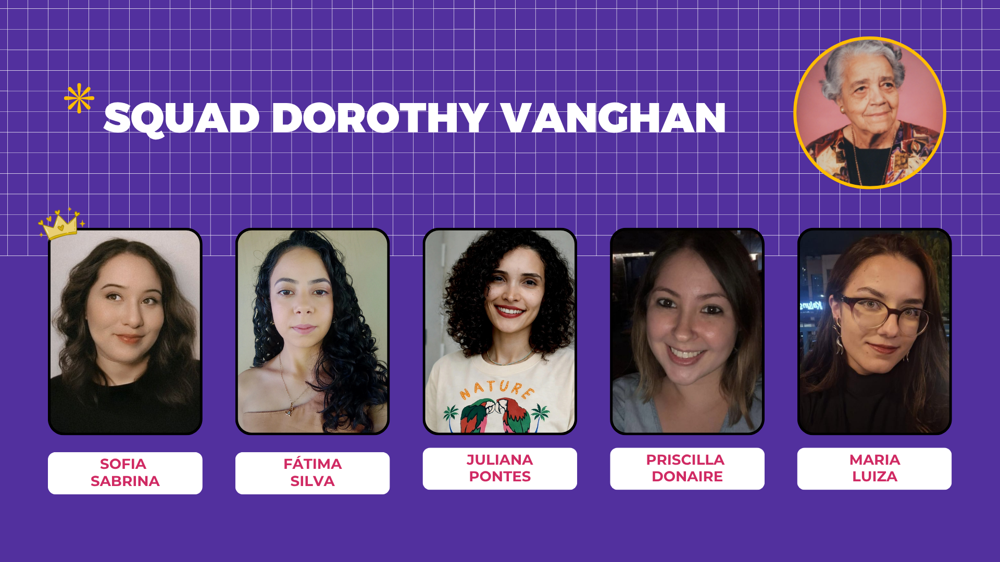

# Squad Dorothy Vaughan

Somos a Squad Dorothy Vaughan, um dos grupos da Turma 10 do [Bootcamp Data Analytics](https://www.womakerscode.org/data-analytics), da Womakers Code.

---

# Quem foi Dorothy Vaughan?



Nossa patrona, Dorothy Vaughan (1910–2008) foi uma matemática, professora e cientista norte-americana que trabalhou no antigo Comitê Consultivo Nacional para Aeronáutica (NACA), que mais tarde se tornou a NASA. Ela nasceu em Kansas City e destacou-se em uma época marcada pela segregação racial e desigualdade de gênero nos Estados Unidos.  

Durante sua carreira, Dorothy trabalhou com cálculos matemáticos essenciais para pesquisas aeronáuticas e missões espaciais. Posteriormente, tornou-se especialista em programação, aprendendo linguagens como FORTRAN para acompanhar a chegada dos computadores.  

## Principais conquistas:
* Primeira supervisora negra da NACA/NASA: tornou-se líder da equipe conhecida como West Area Computers, formada por mulheres negras responsáveis por cálculos matemáticos avançados.
* Contribuição para a corrida espacial: seu trabalho ajudou no desenvolvimento de pesquisas aeronáuticas e espaciais que influenciaram missões importantes.
* Pioneirismo em programação: percebeu cedo que os computadores substituiriam cálculos manuais e aprendeu programação, ajudando outras mulheres a se adaptarem às novas tecnologias.
* Liderança e inclusão: abriu caminhos para mulheres negras em áreas de ciência, tecnologia, engenharia e matemática (STEM).

## Curiosidades e impacto na sociedade/tecnologia/ciência:
* Dorothy enfrentou barreiras de racismo e sexismo, mas conseguiu ocupar posições de liderança em um ambiente dominado por homens brancos.
* Seu trabalho influenciou a transição dos cálculos manuais para a computação, contribuindo para a modernização tecnológica na área aeroespacial.
* Hoje, ela é considerada um símbolo de representatividade feminina e negra na ciência e tecnologia, inspirando novas gerações a seguirem carreiras em STEM.

--- 

## Filme - Estrelas além do tempo:


Sua história ganhou maior reconhecimento com o livro e o filme Hidden Figures (Estrelas Além do Tempo), que mostra a trajetória das cientistas negras Dorothy Vaughan, Katherine Johnson e Mary Jackson na NASA durante a guerra fria.

### Sinopse:
Em, 1961, plena Guerra Fria, Estados Unidos e União Soviética disputam a supremacia na corrida espacial ao mesmo tempo em que a sociedade norte-americana lida com uma profunda cisão racial, entre brancos e negros. Tal situação é refletida também na NASA, onde um grupo de funcionárias negras é obrigada a trabalhar a parte. É lá que estão Katherine Johnson (Taraji P. Henson), Dorothy Vaughn (Octavia Spencer) e Mary Jackson (Janelle Monáe), grandes amigas que, além de provar sua competência dia após dia, precisam lidar com o preconceito arraigado para que consigam ascender na hierarquia da NASA.

### Cientistas inspiradoras do filme:


Da esquerda para a direita: Katherine Johnson, Mary Jackson e Dorothy Vaughan.

---

#  [Sobre a WoMakersCode](https://www.womakerscode.org/)

A WoMakersCode foi fundada em 2015 com o propósito de ampliar
o acesso de mulheres à tecnologia e apoiar o desenvolvimento de suas carreiras na área.
Idealizada por Cynthia Zanoni, a iniciativa começou conectando mulheres
interessadas em tecnologia e criando oportunidades de aprendizado, troca e crescimento profissional.

Com a expansão da comunidade e o fortalecimento das suas iniciativas,
em 2021 a WoMakersCode se tornou uma organização sem fins lucrativos (ONG)
de inclusão produtiva de mulheres na tecnologia, ampliando sua atuação em formação técnica, mentoria e empregabilidade.

Hoje, a organização conecta mulheres em diferentes países e fortalece
um ecossistema que impulsiona carreiras e amplia oportunidades no mercado de tecnologia.

# [O Bootcamp Data Analytics](https://www.womakerscode.org/data-analytics):
O Bootcamp é dedicado a mulheres cis e trans, onde, em uma jornada de 6 meses as alunas tem acesso a aulas ao vivo e ao conteúdo gravado com as habilidades técnicas e habilidades pessoais:
* Habilidades Técnicas: Python para análise de dados, estatística aplicada, modelos regressivos, visualização de dados, Business Intelligence, storytelling, Git/GitHub, bancos de dados e computação em nuvem.
* Habilidades Pessoais: Planejamento e estratégia de carreira, trabalhos individuais e em squads, empregabilidade, preparação para processos seletivos, cultura de inovação, empatia, cooperação e desenvolvimento de power skills.

---

# Integrantes da Squad:


| Integrante | Linkedln |
| :--- | :---: |
| 👑 Sofia Sabrina  👑| [](https://www.linkedin.com/in/sofia-sabrina-silva/) |
| Fátima Silva | [](https://www.linkedin.com/in/fatimasouzasilva/) |
| Juliana Pontes | [](https://www.linkedin.com/in/julianaxpontes/) |
| Maria Luiza | [](https://www.linkedin.com/in/maria-luiza-fernandes-871a65238/) |
| Priscila Brasil | [](https://www.linkedin.com/in/priscilla-donaire) |

---

# Tecnologias que usamos:


---

```py
print('Feito com carinho 🦋🌹')
```
